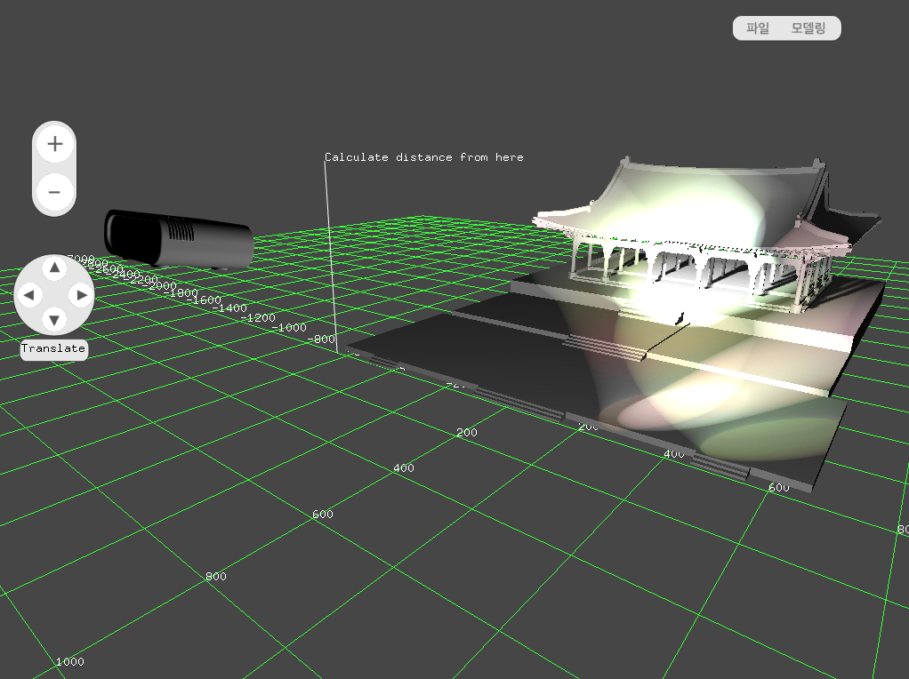

# Projection Mapping Simulator

 Platform : Mac OS, Windows
 Language : C++
 IDE : Xcode, Visual Studio 2015
 External Library : openFrameworks (http://openframeworks.cc/)
 Compile Environment : 64 bit release mode

 More info about program in this projector's wiki (https://github.com/NabiEILAB/ProjectionMappingSimulator/wiki)
 </img> 
