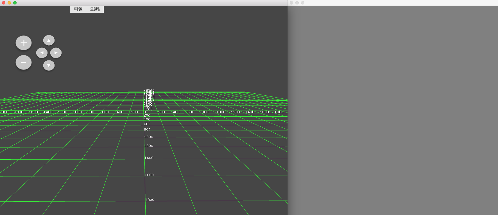
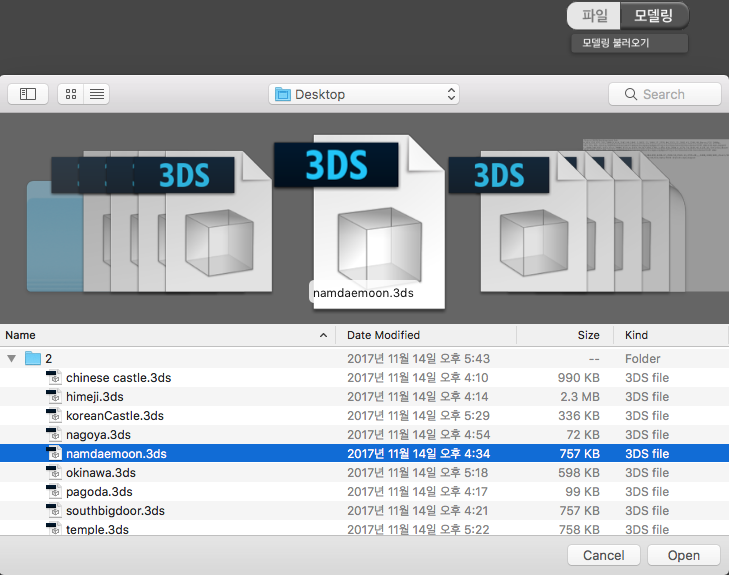
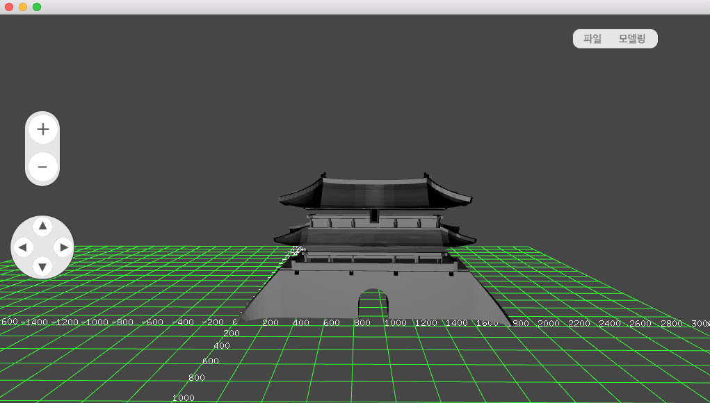
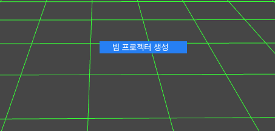
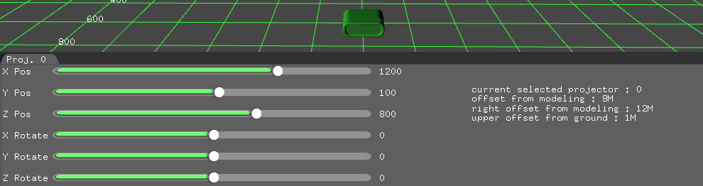
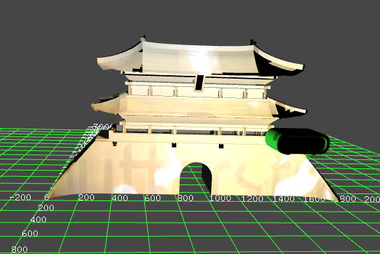
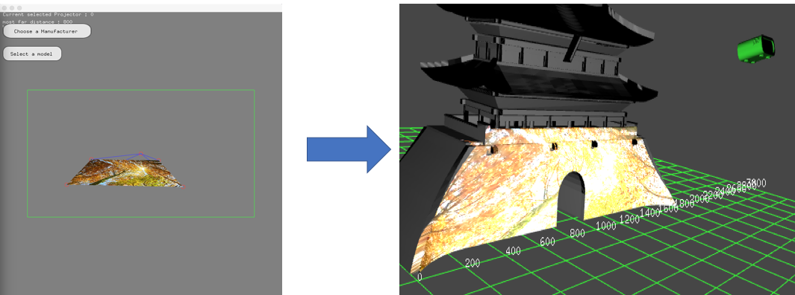

# ProjectorSimulator

 Mac 64bit release 모드에서 실행한다.
 실행하면 3차원 그리드가 그려진 3차원 공간을 둘러볼 수 있다.
 공간에 3D 모델링 파일과 비디오 파일을 열 수 있다.
 별도의 윈도우 창을 통해 현재 재생되는 비디오 이미지를 마우스로 왜곡시키며
 왜곡된 비디오 영상은 실시간으로 프로젝션 맵핑에 적용이 된다. 

- Projector.h, cpp 설명
 Projector 클래스는 프로젝터 기계를 의미
 XYZ좌표이동과 XYZ축회전 가능
 실제 프로젝터의 스펙을 멤버변수로 이용할 예정
 각 프로젝터마다 개별적으로 사용할 영상을 파일 다이얼로그로 골라서 지정 

- MappingApp.h, cpp 설명
 MappingApp 클래스는 비디오 영상을 왜곡시킬 작업공간이다.
 특정 프로젝터에 지정되어 재생되는 비디오 영상을 윈도우 공간에 그림
 윈도우 공간에 그려진 비디오 영상의 4개 꼭지점을 마우스를 통해 드래그하여 조정시켜 영상을 왜곡 

- 현 구현상황
 기본 제공된 ofEasyCam으로 free camera 구현
 projector 오브젝트는 마우스로 선택이 가능. 선택된 프로젝터의 숫자가 좌측상단에 표시
 빔 프로젝터를 통해 영상을 쏜다는 느낌으로 시뮬레이션
 그림자 맵핑을 통해 세부적인 텍스쳐 영역 처리
 광원 맵핑을 통해 세부적인 텍스쳐 영역 처리
 다중 프로젝터 운영에 대한 렌더링 처리(최대 7대 한정)
 영상자체를 왜곡시켜 이를 실시간으로 반영 

  
 테스트 방법
</img>
 프로그램을 실행하면 3차원 그리드를 바라보는 화면과 별도의 윈도우창이 생성
</img>
 마우스를 이용하거나 혹은 버튼을 이용하여 카메라를 자유롭게 이동할 수 있다.
</img>
</img>
 상단의 "파일"부분은 미구현이며 옆의 "모델링" 메뉴를 통해 나온 드롭박스를 이용하여 3D 모델링을 불러올 수 있다.
 단, 현재 모델링 파일의 세부적인 좌표위치 및 축회전을 적용할 수 없어서 프로그램상 임의로 고정된 값을 이용 
 현재 불러올 수 있는 모델 확장자 - 3ds,ase,dxf,hmp,md2,md3,md5,mdc,mdl,nff,ply,stl,x,lwo,obj,smd,collada
</img>
 그리드 좌표에 마우스 오른쪽 버튼을 클릭하면 해당 좌표에 빔 프로젝터 오브젝트를 생성할 수 있다.
</img>
 3D 모델링으로 표현된 빔 프로젝터를 확인할 수 있고 하단의 패널 슬라이더를 통해 빔 프로젝터의 이동과 회전이 가능하다.
 우측의 패널창에서는 (0,0,0)을 기준으로 현재 빔 프로젝터의 상대위치를 설명한다.
</img>
 빔 프로젝터 모델링에 마우스 오른쪽 버튼을 클릭하면 빔 프로젝터에 비디오 영상을 로드하거나 빔 프로젝터를 제거할 수 있다.
</img>
 영상과 모델링이 로드되어 있으면 빔 프로젝터의 위치에 따라 알맞게 모델링에 영상이 입혀지게 된다.
</img>
 우측의 윈도우에서는 영상을 '워핑'하여 원하는 모양으로 영상이 맵핑될수 있게 한다.

- TODO
1. 도량 통일 : 좌표계에서의 1씩 이동을 실세계의 몇cm,m로 환산할지? -> 현재는 좌표상의 1이동을 1cm로 지정할 예정
2. 3D 모델링의 Scale 계산만은 가능하게끔 UI에 추가하기
3. Projector 객체의 비디오 플레이백 기능 구현(GUI 패널에서 버튼 클릭?)
4. Projector의 종횡비를 사용자가 임의로 조절하게끔 UI에 추가하기
5. Save & Load 구현
